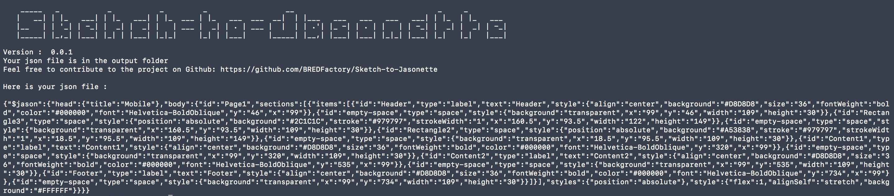
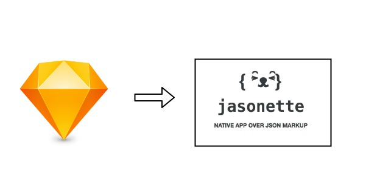
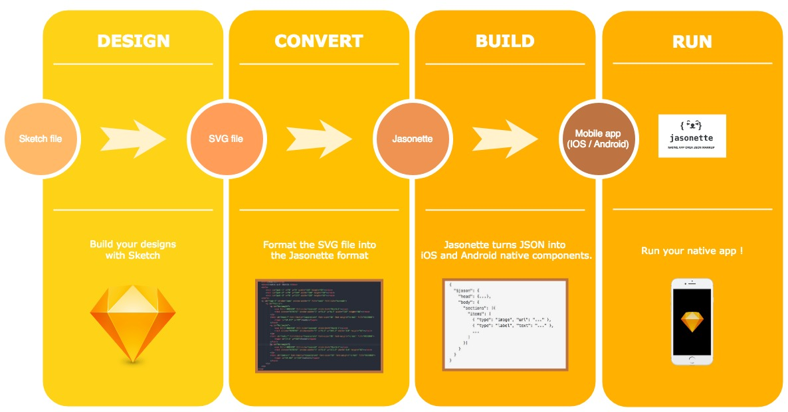
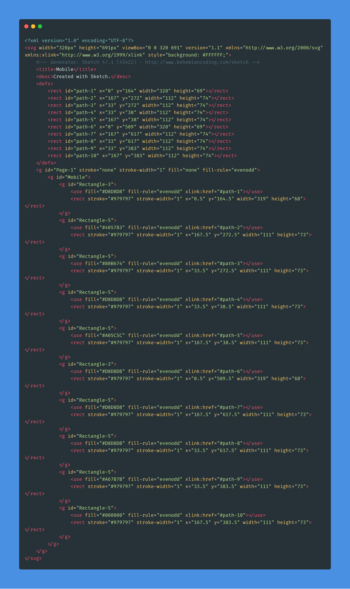
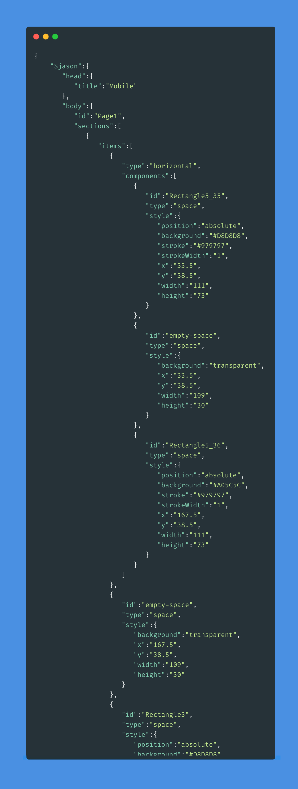
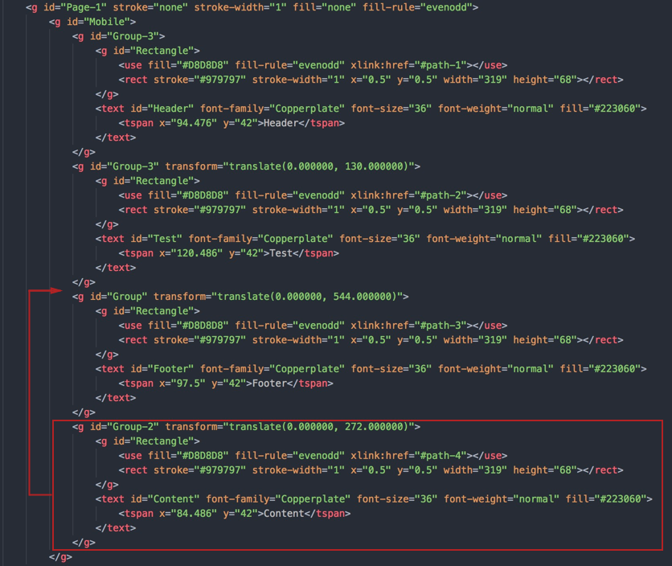

  

Do you want to run your Sketch designs on mobile into native app ?  
Using **Sketch To Jasonette** librairy will automate your prototyping phase.

## Why ?

After discovering [Jasonette](https://jasonette.com/) at a conference, I said to myself "Why not using jasonette to **build native** app with **Sketch** ?"  
In fact, we can export sketch file to svg.
Why not taking that output and converting it to be into the jasonette format ?  
It could be a great way to improve the prototype phase of the development process.

# How it works ?

## Steps to follow

- Clone the project
- Go into the cloned project
- Run `npm install`
- Export your Sketch component as an SVG.
- Use that component as the argument for the library : `node ./src/index.js ./YOUR_DIRECTORY/test.svg`

You should be able to find your json file into the output folder.  
Use this file in the [Jasonette Quick Start](https://docs.jasonette.com/#quickstart) to see your first app running.

## What it does ?

For the moment the tool is just a POC which will be improved in the future.
It takes a sketch exported svg file in input and output a json file in the jasonette format.

## Result

You can test your output file on https://jasonette.github.io/Jasonette-Web/demo/ipfs/

**Turn this:**

  

**Into this:**

  

## Issues

  If you have an **order issue** please re-order the components into the svg file before running the command again :

  

**NOTE:** This is **not** a finished tools ! It needs to be improved.
Feels free to add Issues and submit Pull Requests if you want to !

I got inspired by the [sketch-to-react-native](https://github.com/nanohop/sketch-to-react-native) tool as a base to start.
